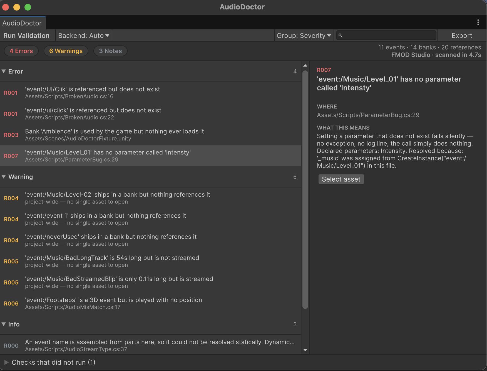

# Audio Toolbox

Editor tooling for game audio debug work in Unity + middleware(FMOD, Wwise) workflow.

One package, several modules. Each module is a self-contained set of assemblies,
so the ones you do not use cost disk space and nothing else.




## Modules

| | | Status |
|---|---|---|
| **[AudioDoctor](Documentation~/AudioDoctor.md)** | Static validation for audio pipelines — reconciles what the middleware declares, what the banks contain and what the project references, then reports the gaps | v0.1 |
| **[EventTracer](Documentation~/EventTracer.md)** | Runtime tracing — records every sound posted through its facade, tells the seven ways one can fail to be heard apart from each other, and puts them on a timeline with the emitter, the call site and the game state behind each one | v0.2 · FMOD |

## Install

Unity **Package Manager** → **+** → **Add package from git URL**:

```
https://github.com/songdsp/audio-toolbox.git
```

Or in `Packages/manifest.json`:

```json
"com.songyuan.audiotoolbox": "https://github.com/songdsp/audio-toolbox.git"
```

This tracks `main`. There are no release tags yet, so the package moves as `main`
does — expect breaking changes until a tagged release exists.

Unity resolves the git URL once and caches the result, so pulling in later work
means **removing the package and re-adding it**; simply reopening the project
will not fetch new commits. To hold a specific commit in the meantime, append
`#<commit-sha>` to the URL.

### Requirements

**Unity 6000.0 or newer.** No package dependencies — the JSON writer is
hand-rolled rather than pulling in Newtonsoft, because a tool should drop into
someone else's project without adding to their dependency graph.

**Audio middleware is optional.** `AUDIOTOOLBOX_FMOD` and `AUDIOTOOLBOX_WWISE`
are added and removed automatically to match what is actually installed, and the
project's own scripting defines are left alone. A fresh clone compiles whether
you have both middlewares, one, or neither; modules degrade to what the
available data supports rather than failing to build.

If detection ever gets out of step — after installing a middleware without
letting the editor reload, say — **Window → Audio Toolbox → Re-detect
Middleware** forces a re-check.

**`AUDIOTOOLBOX_TRACE` is opt-in and stays that way.** It compiles in
EventTracer's collection layer. Unlike middleware presence, that is a decision
about a build rather than a fact about the project, so nothing sets it for you:
**Window → Audio Toolbox → EventTracer → Record Traces**.

## Layout

```
Editor/                  toolbox-wide infrastructure shared by every module
Modules/<Name>/          one module: Runtime, Editor, Backends, Tests
Documentation~/<Name>.md one document per module
Tools/<Name>~/           scripts run outside Unity; the ~ keeps them out of the importer
```

Assemblies are named `AudioToolbox.<Module>.<Layer>`. A module's tests depend on
its own assemblies only, never on a middleware backend — which is what lets them
run on a machine with no middleware installed at all.

## Licence

MIT — see [LICENSE.md](LICENSE.md).
